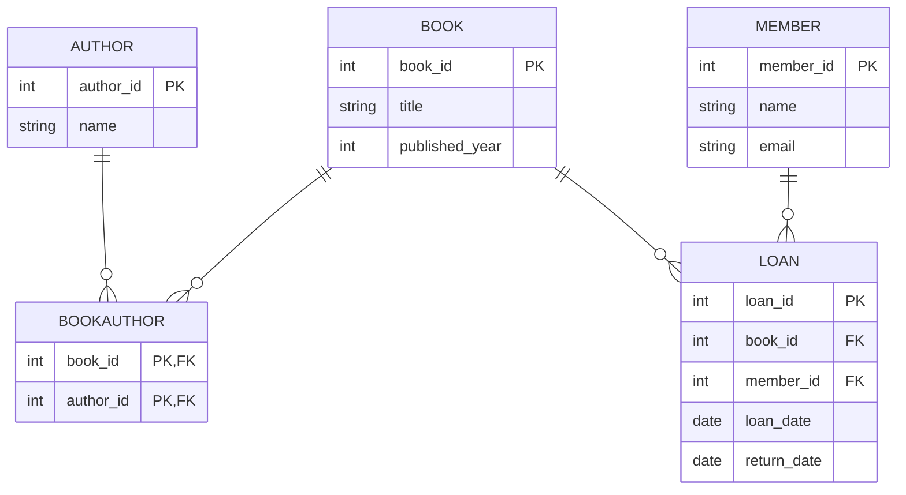

# Library Database Schema

This project provides a sample relational database schema for a simple **Library Management System**. It is designed to demonstrate basic database modeling concepts, including entities, relationships, primary and foreign keys, and many-to-many associations.

## Domain

The schema models a library where:
- Books can have multiple authors.
- Members can borrow (loan) books.
- Each loan records which member borrowed which book and when.

## Entities and Relationships

- **Author**: Represents book authors.
- **Book**: Represents books in the library.
- **Member**: Represents registered members of the library.
- **Loan**: Tracks when a member borrows a book.
- **BookAuthor**: Join table for the many-to-many relationship between books and authors.

## Entity-Relationship (ER) Diagram

## Getting Started

### Prerequisites

- MySQL, PostgreSQL, or SQLite (adjust data types if using SQLite).
- A database management tool (e.g., MySQL Workbench, pgAdmin, SQLiteStudio).

### Setup

1. Clone or download this repository.
2. Open your SQL tool and connect to your database.
3. Copy the contents of `library_schema.sql` into a new SQL script window.
4. Run the script to create the schema.

### File Overview

- `library_schema.sql` — SQL script to create all tables and relationships.
- `README.md` — This documentation.

## Notes

- The schema uses `AUTO_INCREMENT` for primary keys (MySQL style). For PostgreSQL, use `SERIAL` instead. For SQLite, use `INTEGER PRIMARY KEY AUTOINCREMENT`.
- Foreign keys are used to enforce relationships.
- The schema can be extended with additional fields (e.g., address for members, genres for books).

## License

This example is provided for educational purposes.