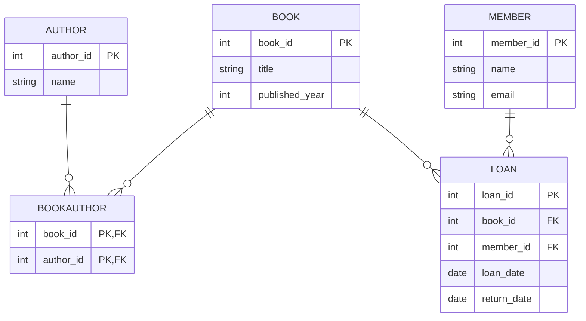

```mermaid
erDiagram
    AUTHOR ||--o{ BOOKAUTHOR : ""
    BOOK ||--o{ BOOKAUTHOR : ""
    BOOK ||--o{ LOAN : ""
    MEMBER ||--o{ LOAN : ""

    AUTHOR {
        int author_id PK
        string name
    }
    BOOK {
        int book_id PK
        string title
        int published_year
    }
    BOOKAUTHOR {
        int book_id PK, FK
        int author_id PK, FK
    }
    MEMBER {
        int member_id PK
        string name
        string email
    }
    LOAN {
        int loan_id PK
        int book_id FK
        int member_id FK
        date loan_date
        date return_date
    }
```